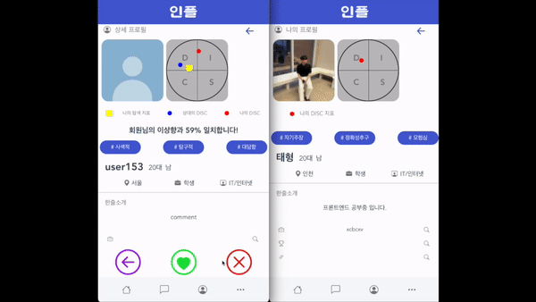
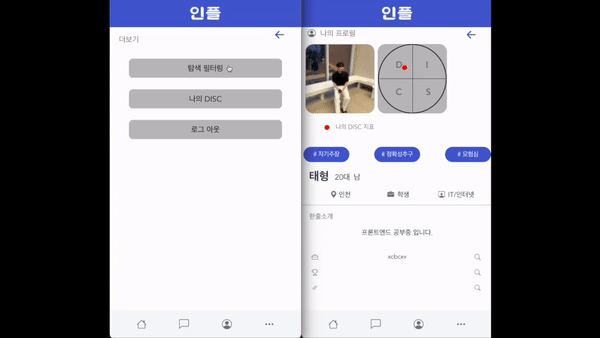
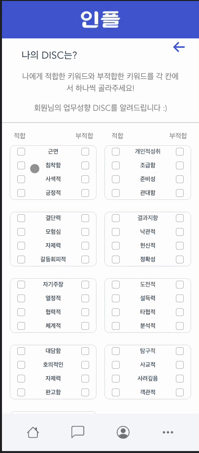
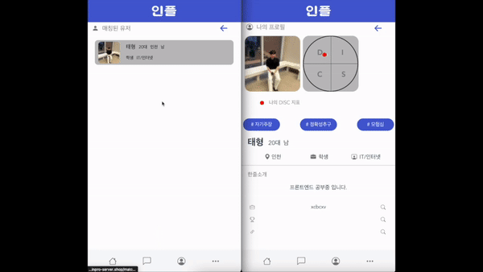

## 팀, 팀원 매칭 앱 : 인플 프로젝트
- [프로젝트 URL](https://prod.inpro-server.shop/kakaologin)

- 1:1이나 1:팀 단위의 프로젝트 맞춤 추천 서비스 제공
  - 소개팅 앱 방식으로 1:1, 1:팀 추천 진행

- 유저 행위 데이터를 분석하여 유저 맞춤형 추천 서비스 제공
  - 유저가 좋아요를 누를 때마다 추천 가중치가 정교화
  - 유저가 선호하는 데이터를 추천할 수 있도록 추천 가중치 조정
  - 추천 정확도는 점진적으로 향상됨

- 업무 카테고리 기반 필터링과 함께 개인의 업무 성향을 기반으로 추천 기능 제공
  - 팀원 필터링 적용(연령대, 지역, 직업군, 관심 분야)
  - 팀 필터링 적용(팀 유형, 지역, 관심 분야)
  - 유저가 선택한 키워드를 기반으로 유저 업무 성향 x, y 좌표 값을 계산

- 프로젝트 종료 후 팀원 평가 기반으로 업무 성향 조정
- 프로젝트/스터디/대외활동/동아리/창업/공모전 등 다양한 유형 매칭 지원

- 머신러닝을 활용한 유해 이미지 차단 서비스 제공
- 유저 차단/신고 기능

- 1:1 매칭 시 1:1 채팅으로 소통 가능
- 1:팀 매칭 시 단체 채팅으로 소통 가능

- - -

### STACKS
- 개발 언어 : JDK 11(JAVA)
- Web Framework : Spring-Boot
- IDE : IntelliJ
- Build Tool : Gradle

- Database : MySQL 5.7.21
- Database Service : Amazon RDS
- Database tool : DataGrip

- Deployment : AWS EC2
- OS : Ubuntu 20.04
- Web Server : Nignx 1.10.3
- Storage Service : AWS S3
- Version control : Github, Git
- Open Source : Kakao Login API

- - -

### ERD 설계

AQueryTool : https://aquerytool.com/aquerymain/index/?rurl=731082ef-0f8b-42cf-ace0-3b1a36f84451 (pwd : 5042tm)

- - -

### API 문서
https://prod.inpro-server.shop/swagger-ui.html
